# Ein Kubernetes Hallo Welt mit Minikube und Windows
Im Augenblick sind wir mitten in der Entwicklung unseres KillerBots, mit dem man die Widerstandsfähigkeit (Resilience) von Applikationen in einem Kubernetes Cluster analysieren kann. Wenn Du an diesem Thema interessiert bist, kannst Du einen Blick auf meinen Blog zum KillerBot werfen [killer-bots-ki-monkeys](https://www.mt-ag.com/killer-bots-ki-monkeys-fur-widerstandsfahige-systeme/). Wir haben dazu eine große Applikation, die auf einem Kubernetes Cluser in der Azure Cloud läuft. Hier trainirt die KI des Killer Bots permanent und versucht die einzelnen Services an den Rand ihrer Belastung zu bekommen.

Für mich hat es sich wärend der Arbeit als effektiv erwiesen, einzelnen Teile und Aspekte einer Applikation herauszuziehen und quasi unter Laborbedingungen nachzustellen. Dazu nutze ich Minikube [MiniKube](https://kubernetes.io/docs/setup/minikube/) also den ganz kleinen Brude von Kubernetes, der in einem einzigen Knoten auf einer lokalen Maschine läuft. 

In diesem Blog zeige ich Schritt für Schritt, wie man eine kleine SpringBoote Applikation in Minikube auf einer Windows Mashine laufen lässt. Leider ist die Sache nich ganz "easy as Apple". Es wäre schön, wenn es eine einfach setup.exe gäbe, die einem alles nötige auf seinem Rechner installier, aber die gibt es im Augenblick noch nicht. Somit: Ärmel hochkrempeln, Kaffee holen und los gehts.

# Installation

## Vorbereitungen
Ein paar wenige Dinge solltest du bereits erledigt haben:

1. Docker für Windows läuft auf deinem Rechner. Wenn nicht, kannst du das einfach und simple über diese Seite hier nachholen: [set up docker-for-windows](https://docs.docker.com/docker-for-windows/install/)
2. Du hast einen Account für [docker hub](https://hub.docker.com/)
3. Das Docker Hello World läuft auf Deinem Rechner, damit du weißt, dass alle nötigen Vorbedingungen abgeschloßen sind: `docker run --rm hello-world`. Das Ergebnis sollte in etwa so aussehen:
```
```
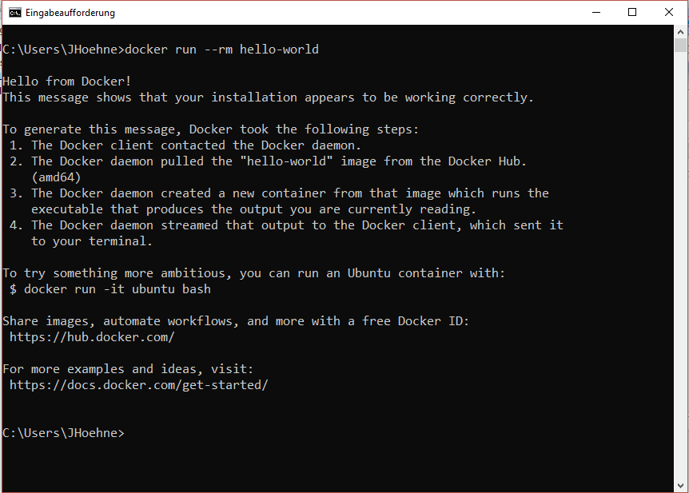

4. Du solltest den Windows Packetmanager [chocolatey](https://chocolatey.org/) bei Dir installiert haben. Es geht zwar auch ohne aber zu diesem Installationspfad findest du viel Hilfe im Netz, wenn du mal nicht weiter weißt.  

## Minikube installiern

### 1. Virtuellen Netzwerk Switch einrichten
Minikube läuft in einer virtuellen Mashine im Hyper-V. Man kann Minikube theoretisch auch in der VirtualBox von Oracle laufen lassen, das hat sich für mich aber als extrem unpraktisch herausgestellt. Mir scheint, das würde sich nur lohnen, wenn man den Hyper-V von Windows nicht schon unter der Haube hat. Minikube muß massiv mit der Außenwelt kommunizieren. Zum einen läd es sich selbst aus dem Internet herunter und zum anderen kann man Docker Images nur aus dem Docker Hub beziehen. für diese Kommunikation legt man im Hyper-V eine Netzwerkbrücke ein, die nach Außen geht.

#### 1.1 Öffne das Hyper-V Administrations GUI 
```
```
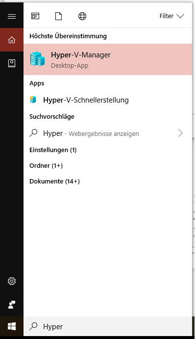 

#### 1.2 Den Manager für Virtuelle Switches öffnen 
```
```
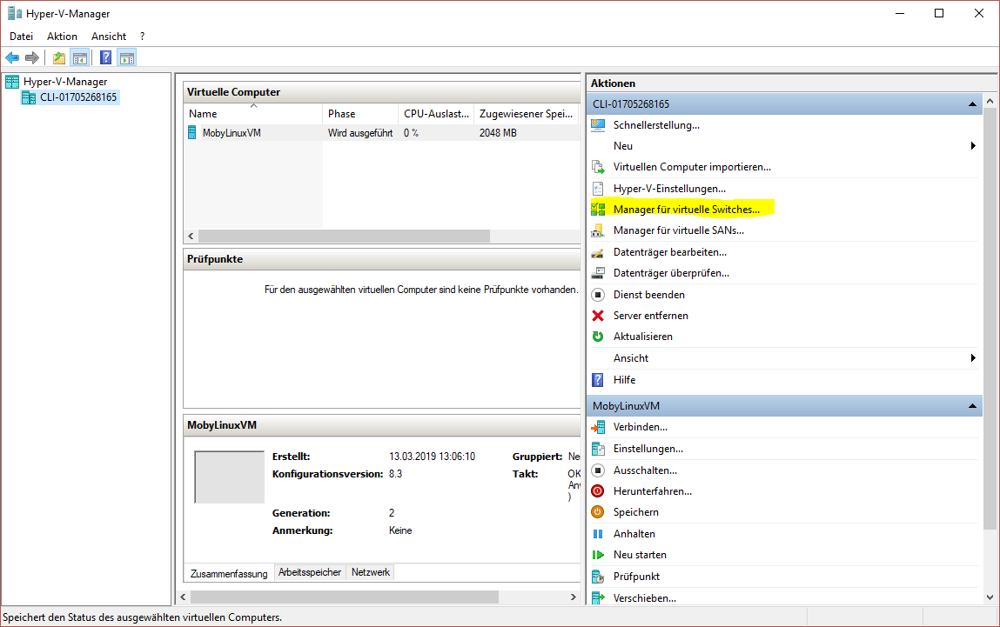 

#### 1.3 Einen neuen externen Switch erstellen 
```
```
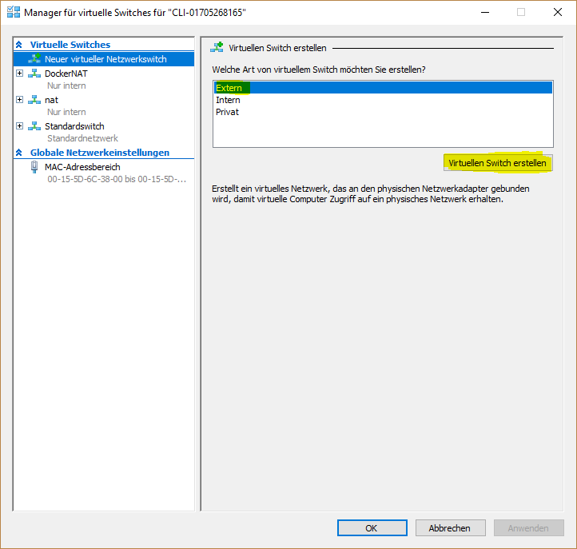 

#### 1.4 Den Switch konfigurieren. 
Du kannst den Switch so nennen, wie Du möchtest, ich habe mich für "minikube_switch" entschieden. Den Namen brauchst du später jedes mal, wenn Du Deinen Minikube startes. Mit dem Klick auf OK wird der Switch angelegt. 
```
```
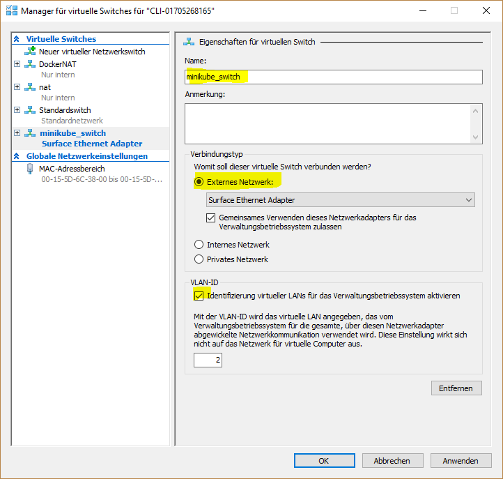 

### 2. Minikube installieren
Ich habe mich dazu entschieden, Minikube über [chocolatey](https://chocolatey.org/) zu installieren. Wenn Du das nicht machen möchtest, findest Du hier andere Methoden, die sicherlich unter der einen oder anderen Konstellation besser funktionieren. [https://kubernetes.io/docs/tasks/tools/install-minikube/#windows](https://kubernetes.io/docs/tasks/tools/install-minikube/#windows)

#### 2.1 Öffne die CMD als Admin
Was mir wärend der Installation als sehr unangenehm aufgefallen ist, war, dass ich permanent zwischen der Windows CMD und der PowerShell hin und her springen musste. Für die installation funktionierte die CMD bei mir besser. Sie muss aber unbedingt im Administrator Modus laufen (rechtsklick auf das Icon) 
```
```
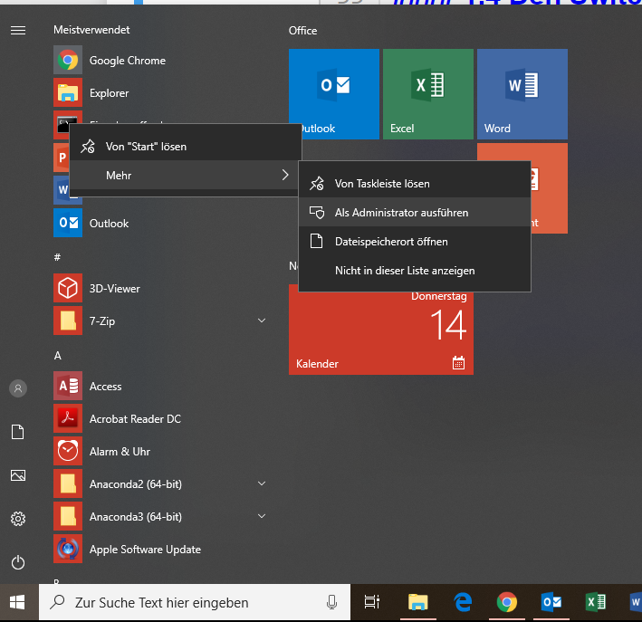 

#### 2.2 Minikube installieren
Die eigentliche Installation ist extrem simple 
```
choco install -y minikube kubernetes-cli
```

#### 2.3 Alten Müll raustragen
Wenn man schon etwas mit Minikube herumgespielt hat oder ein paar erfolgloose Versuche hinter sich hat Minikube zu starten, muss man sich von alten Artefakten befreien. 
1. Zum einen wird in deinem Userverzeichnis eine Verzeichnis mit dem Namen ```.minikube``` angelegt. Das solltest Du unbedingt löschen. 
2. Falls das nicht gehen sollte, weil Windows sich auf Grund offener Prozesse weigert, musst Du im Hyper-V Admin GUI die Virtuelle Maschine mit dem MiniKube herunterfahren und löschen. Das kann manchmal wirklich verzwickt sein. Ich hatte Situationen in denen ich mehrfach neu starten musste, bis mir dies gelang.
3. Falls Du `kubectl` bei dir installier hast, solltest Du prüfen, ob die Configuration auf den minikube gestellt ist `kubectl config use-context minikube` sonst kommt minikube mit den Zertifikaten durcheinander. 


## Minikube starten

### 1. Minikube starten
Der start sollte aus der PowerShell im Admin Modus geschehen (Bei mir hat sie die CMD immer wieder aufgehängt).
```
minikube start --vm-driver hyperv --hyperv-virtual-switch "minikube_switch" --disk-size 10g --memory 4096 --v 9
```
Der erste Start dauert eine Weile (Minuten), da erst mal alle nötigen Dateien heruntergeladen werden müssen und eine Virtuelle Maschine im Hyper-V gestartet werden muss.

Der Schalter `--v 9` erhöt den Loglevel auf der Konsole. Falls der Start hängenbleiben sollte, bekommst Du wenigstens einige Informationen, mit denne Du Google befragen kannst.

Man kann überprüfen, ob wichtigsten dinge funktioniert haben, wenn man sich die Minikube VM im Hyper-V Admin GUI anschaut 
```
```
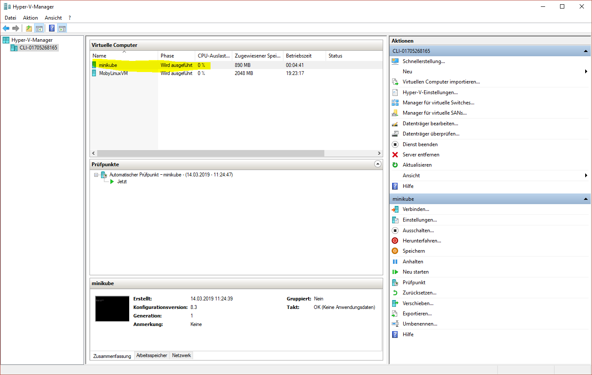 

Die IP der VM, in der Dein Minikube läufst bekommst Du übrigens über `minikube ip` heraus. Das ist dann auch die IP, die Du im Browser angeben musst, um über Deine Services mit Deinen deployten Pods zu reden. 

### 2. Dashboard starten und öffnen
Minikube bringt das Kubernetes Dashboard gleich mit. Das war für mich ein Grund, mich für MiniKube und nicht das in Docker-for-Windows eingebettete Kubernetes zu entscheiden, da man dort auf das Dashboard verzichten muss, wenn man es nicht nachinstallieren will oder kann.
Das Dashboard zu öffnen ist wunderbar einfach:`
```
minikube dashboard
```
Nach wenigen Sekunden öffnet sich wie durch Zauberhand der Browser und zeigt das Kluster
```
```
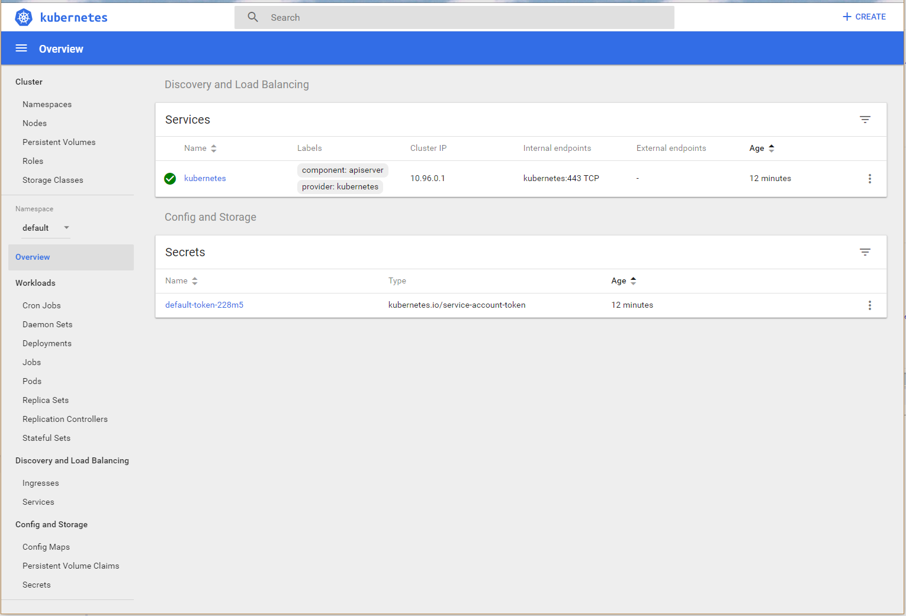 

### 3. Docker Hub Zugriff konfigurieren
Wenn Du Deinen Minikub nun so verwendest wie er ist, wird er alle Docker Images, die Du in Deinen Pods installieren möchtest ausschließloch aus der öffentlichen Docker Repository verwenden. Das ist natürlich keine so gute Idee, wenn Du für Deine Firma an einer neuen Sache arbeitest, und nicht alles offenlegen willst. Somit muß man Minikub mitteilen, dass es die Images aus deinen privaten Repositories auf docker Hub ziehen soll.

Somit muss man ein `Secret` im Minikube anlegen, dass dem Minikub die nötigen Zugangsdaten zur Verfügung stellt.
```
kubectl create secret docker-registry regcred --docker-server=https://index.docker.io/v1/ --docker-username={Dein DockerHub Username} --docker-password={Dein DockerHub passwort} --docker-email={Deine Email, die Du bei DockerHub hinterlegt hast}
```
Du kannst nun in Deinem Dashboard überprüfen, ob das Secret richtig angelegt wurde 
```
```
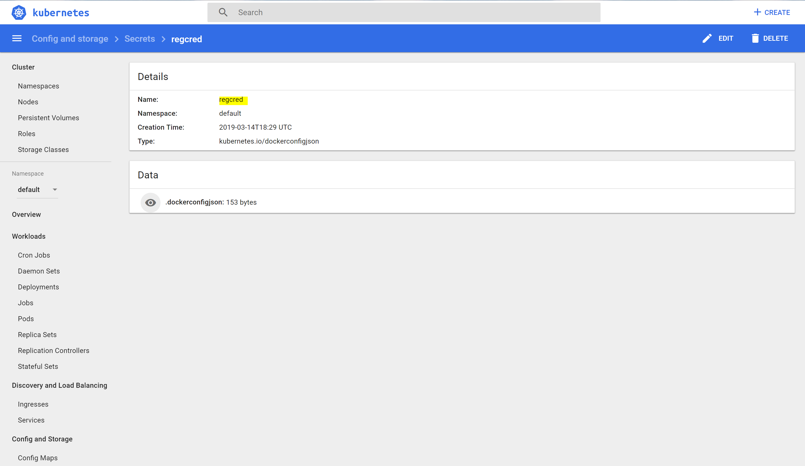 

## Eine Applikation Bauen

### 1. Eine simple SpringBoot Applikation
Zunächst brauchst Du eine ganz kleine SpringBoot Applikation, die Dir einen REST Endpunkt zur Verfügung stellt. Ich gehe davon aus, dass Du das schon kannst und füge hier nur meine pom.xml und die Klasse mit dem REST Service ein. Der rest ist SpringBoot standart, so wie er von [start.spring.io](https://start.spring.io/) erstellt wird.

Meine Applikation generiert eine Losnummer und zeigt sie an.

```
<?xml version="1.0" encoding="UTF-8"?>
<project xmlns="http://maven.apache.org/POM/4.0.0"
	xmlns:xsi="http://www.w3.org/2001/XMLSchema-instance"
	xsi:schemaLocation="http://maven.apache.org/POM/4.0.0 http://maven.apache.org/xsd/maven-4.0.0.xsd">
	<modelVersion>4.0.0</modelVersion>
	
	<parent>
		<groupId>org.springframework.boot</groupId>
		<artifactId>spring-boot-starter-parent</artifactId>
		<version>2.1.3.RELEASE</version>
		<relativePath />
	</parent>
	
	<groupId>de.hoehne.hello</groupId>
	<artifactId>Losnummern</artifactId>
	<version>1.0</version>

	<properties>
		<java.version>10</java.version>
	</properties>

	<dependencies>
		<dependency>
			<groupId>org.springframework.boot</groupId>
			<artifactId>spring-boot-starter-web</artifactId>
		</dependency>
	</dependencies>

	<build>
		<finalName>${project.artifactId}</finalName>
		<plugins>
			<plugin>
				<groupId>org.springframework.boot</groupId>
				<artifactId>spring-boot-maven-plugin</artifactId>
			</plugin>
		</plugins>
	</build>

</project>
```
Abb 10: pom.xml für das Hallo Welt

Und hier der Code, der eine Losnummer generiert. Um die einzelnen gestarteten Instanzen später besser unterscheiden zu können, gebe ich neben der Losnummer auch noch eine UUID mit aus, die ja im Universum eindeutig ist.
```
package de.hoehne.hello.number_generator;

import java.net.InetAddress;
import java.net.UnknownHostException;
import java.util.Random;
import java.util.UUID;

import org.springframework.web.bind.annotation.GetMapping;
import org.springframework.web.bind.annotation.ResponseBody;
import org.springframework.web.bind.annotation.RestController;

@RestController("/")
public class LosnummernController {

	private static Random random = new Random();

	@GetMapping()
	@ResponseBody
	public RandomNumber getRandomNumber() {
		return new RandomNumber(random.nextInt(1000000));
	}

	public static class RandomNumber {

		private static final UUID myId = UUID.randomUUID();
		private int randomNumber;
		private static String hostName;
		static {
			try {
				hostName = InetAddress.getLocalHost().getCanonicalHostName();
			} catch (UnknownHostException e) {
				e.printStackTrace();
			}
		}

		public RandomNumber(int randomNumber) {
			this.randomNumber = randomNumber;
		}

		public int getRandomNumber() {
			return randomNumber;
		}

		public String getHostName() {
			return hostName;
		}

		public UUID getMyid() {
			return myId;
		}

	}
}
```
Abb 11: Generator für Losnummern

Wenn Du den Code bei Dir lokal laufen lässt `mvn spring-boot:run`, solltest Du unter [http://localhost:8080](http://localhost:8080) etwa so eine Textzeile finden:
```
{"randomNumber":21779,"hostName":"CLI-01705268165.mt-ag.com","myid":"c38fe7d8-f8b3-4dc9-b161-d50f27d414e3"}
```

### 2. Die Applikation bauen und zu Docker puschen

#### 2.1 Das JAR bauen
springBoot vereint ja Fluch und Segen, indem es den ganzen Service fix und fertig in ein einziges startbares JAVA jar zusammenbaut. Das auf der einen Seite meist extrem Groß ist und viel unnötigen Platz verschwendet auf der anderen Seite aber keine weitetren Abhänigkeiten hat und somit jenseits der von Entwicklern gefürchteten JAR - Hell lebt. Das Bauen der Applikation ist somit super simpel:
```
mvn clean install
```
wer möchte, kann nun nocheinmal versuchen, ob der build auch geklappt hat und ob die Applikation auch wirklich läuft:
```
java -jar .\target\Losnummern.jar
```
Wenn alles geklappt hat, so sollte man unter [http://localhost:8080](http://localhost:8080) eine weiter Losnummer finden.

#### 2.2 Das Docker Image bauen
Um das Docker Image zu bauen, braucht man im Root Verzeichnis der Applikation noch eine Datei mit dem Namen `Dockerfile`. Der Inhalt ist recht einfach:
```
FROM openjdk:10-jdk

ADD target/Losnummern.jar app.jar

ENTRYPOINT exec java $JAVA_OPTS -Djava.security.egd=file:/dev/./urandom -jar /app.jar
```
Abb 11: Inhalt der Datei `Dockerfile`

Hat man die Datei gespeichert, so kann man das Image auch bauen
```
docker build --tag {dein Docker user}/{Name Deines privaten Docker repositories}:Losnummern .
```
Um die Platzhalter füllen zu können, muss man sich im [Docker Hub](https://cloud.docker.com) noch ein privates Repository anlegen. Bei mir heißt dies number-generator:
```
```
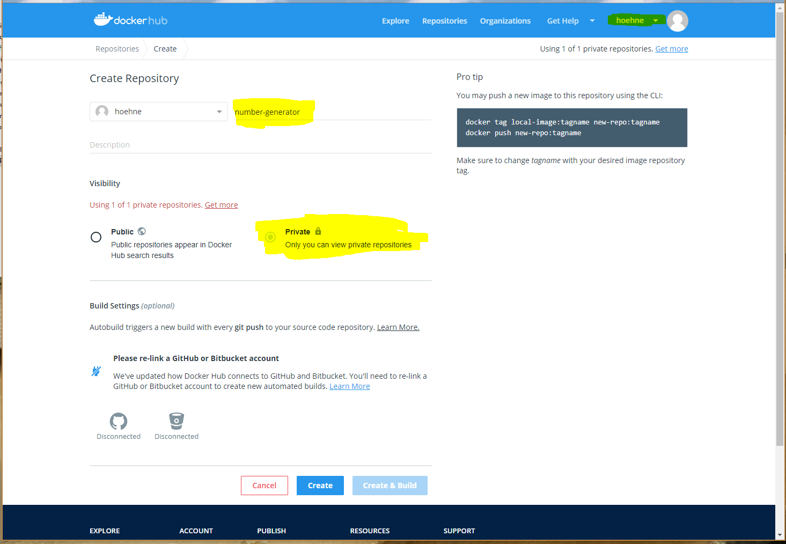

Mit einem normalen kostenlosen Account kann man sich genau ein einziges privates Repository anlegen, desshalb unterscheide ich meine Images über den Tag Name, der in diesem Fall `Losnummern` ist. Dadurch ergibt sich für mich folgender Build Befehl `docker build --tag hoehne/number-generator:Losnummern .`. Vorsicht, der Punkt am Ende ist wichtig. Er sagt, wo die `Dockerfile` liegt.

Wenn der Befehl durchgelaufen ist, kann man sich von dem Erfolg ebenfalls überzeugen, indem man das Docker Image lokal startet:
```
docker run -d -p 8080:8080 --rm --name Losnummern {dein Docker user}/{Name Deines privaten Docker repositories}:Losnummern
```
Unter [http://localhost:8080](http://localhost:8080) solltes Du wieder eine Losnummer sehen. Vergiss nicht die Applikation nachher wieder herunter zu fahren:
```
docker kill Losnummern
```

#### 2.4 Das Docker Image pushen
Nun muß man das Image noch in sein Privates Repository auf [Docker Hub](https://cloud.docker.com) pushen. Das geht ebenfalls einfach:
```
docker push {dein Docker user}/{Name Deines privaten Docker repositories}:Losnummern
```
```
```
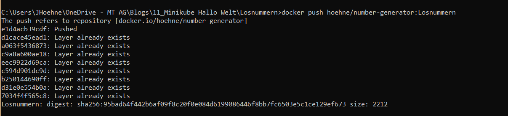

```
```


## Die Apllikation im Minikube installieren
Ich habe alle nötigen Konfigurationen für die Installation in einer einzigen YAML Datei zusammengeschrieben:
```
apiVersion: apps/v1beta2
kind: Deployment
metadata:
  name: losnummern
spec:
  replicas: 3
  selector:
    matchLabels:
      app: losnummern-label
  template:
    metadata:
      labels:
        app: losnummern-label
    spec:
      containers:
      - name: losnummern-container
        image: hoehne/number-generator:Losnummern
        ports:
        - containerPort: 8080
      imagePullSecrets:
      - name: regcred
---
apiVersion: v1
kind: Service
metadata:
  name: losnummern-service
spec:
  selector:
    app: losnummern-label
  ports:
  - protocol: TCP
    port: 8080
    nodePort: 30000
  type: NodePort 
```
Abb 16: `k8s-deployment.yml`für die Installation in Kubernetes

Somit genüt ein einziger Aufruf, um die SpringBoot Applikation in Kubernetes zur Verfügung zu stellen:
```
kubectl apply -f k8s-deployment.yml
```
```
```
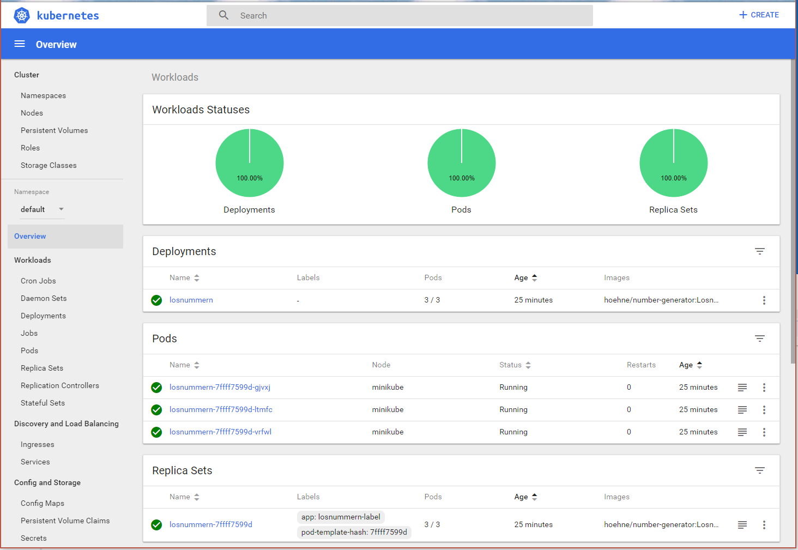

Nun muss man eigentlich nur noch herausfinden, unter welcher IP und unter welchem Port der Service für die Außenwelt zur verfügung gestellt wurde. Das läßt sich beim MiniKube erfragen:
```
minikube service losnummern-service --url
```
Auf meinem Rechner ist die Antwort [http://10.77.108.126:30000/](http://10.77.108.126:30000/) auf Deinem ist es sicherlich anders. Nichts desto Trotz:

Done!

# Abschließende Gedanken
Ich fand das Experiment durchaus spannen, es hat mir in meiner Arbeit aber nicht wirklich weiter geholfen, da MiniKube auf meinem Windows extrem unstabil läuft. Jedesmal, wenn mein Rechner in den Ruhemodus fähre (zum Beispiel, wenn ich den Deckel des Notbooks schließe) friehrt MiniKube ein, und ich muß alles komplett abräumen und wieder Aufbauen, was sicherlich zehn Minuten in anspruch nimmt. Mein geheimes Ziel war es eigentlich eine Umgebung zu haben, die ich auch Offline (zum Beispiel in der Deutschen Bahn) betreiben kann. Das ist aber mit zu vielen Hürden verbunden. Ich denke, es ist am Besten, wenn man sich in der Cloud ein kleines Cluster aufbaut und dieses Verwendet. Der HTTP Traffic vom Rechner zum cluster ist gering, da man ja nur die Befehle absetzt. Somit sollte es auch funktionieren, wenn man nur ein Klingeldraht Internet hat, dass man ja fast überall bekommt.

# Hashteags
KI-Werkstatt, Kubernetes, MiniKube, K8s, Tutorial, Installation


