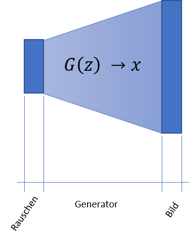
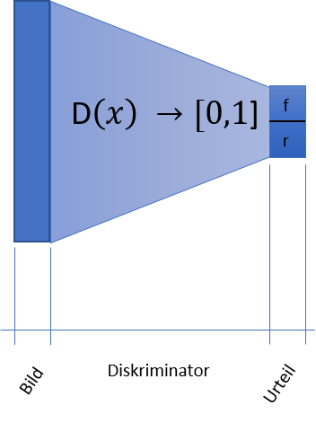
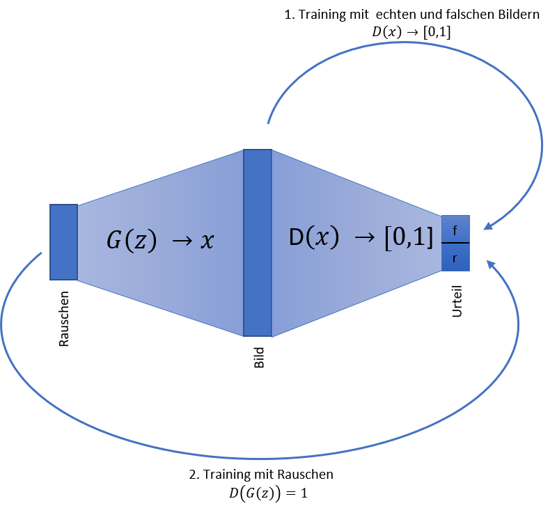

# GAN - Teil 1 – Wie erfinden Computer neue Menschen?
## Ein Bild sagt mehr als tausend Worte
Auf den ersten Blick ist das für mich einfach ein Bild einer gutaussehenden Frau:

Aber etwas stimmt nicht. Das linke Ohr, der rechte Ohrring und die Jacke finde ich irgendwie eigenartig. Wenn ich das Bild einfach so gesehen hätte, wären mir diese Details wahrscheinlich nicht weiter aufgefallen. Ich habe das Bild aber unter [https://thispersondoesnotexist.com/](https://thispersondoesnotexist.com/) gefunden. Diese Seite zeigt Bilder von komplett erfundenen Personen. Will heißen, dass ein neuronales Netz aus einem zufälligen Rauschen das Bild eines Gesichts generieren kann. 

Die KI, die selbständig Bilder, Texte und Musik gestalten kann, nennt sich GAN. Das steht für __G__enerative __A__dversarial __N__etworks also quasi Kreativität durch sportlichen Ehrgeiz. Obwohl die Erfindung der GAN noch nicht sehr alt ist (2014), hat sie dennoch bereits eine breite Variation von Spezialisierungen auf bestimmte zu generierende Aspekte vorzuweisen. Auch der Generator für das obige Bild wurde nicht „mal eben aus dem Handgelenk geschüttelt“. In ihm stecken sehr viel gesammelte Erfahrung und Wissen.

Glücklicher Weise ist der Einstieg in die Welt der GAN aber nicht sehr schwer. Wenn man prinzipiell verstanden hat, wie neuronale Netze funktionieren, kann man sich sein erstes einfaches GAN schnell selbst bauen. 

Im ersten Teil dieses Blogs möchte ich zeigen wie der Trick mit den GAN funktioniert. Im zweiten Teil möchte ich ein simples GAN in Keras bauen, dass handschriftliche Nummern generieren kann.

Wenn Du Dein Wissen über neuronale Netze vorher noch ein wenig auffrischen möchtest, so möchte ich Dir meine Blogartikel zu diesem Thema empfehlen:

* [Einstieg in neuronale Netze mit Keras](https://www.mt-ag.com/einstieg-in-neuronale-netze-mit-keras/)
* [Einstieg in Convolutional Neuronale Netze mit Keras](https://www.mt-ag.com/einstieg-in-convolutional-neuronale-netze-mit-keras/)
* [So entwirft man ein Top CNN](https://www.mt-ag.com/so-entwirft-man-ein-top-cnn/)

## Das __G__ in GAN
Was man im Endeffekt haben will, ist ein möglichst einfaches neuronales Netz, dass aus einem mit Zufallszahlen belegten Tensor (ein Rauschen) ein Bild erzeugt, von dem man nicht mehr sagen kann, ob es ein Fake ist oder nicht. Dieses Netz nennt man einen Generator. Wir haben also ein:
$$G(z) \to x$$
Dabei ist $z$ das Rauschen und $x$ ein Bild. Wenn wir dieses Netz hätten, könnten wir für heute Feierabend machen und mit unseren Erfolgen prahlen. Dummerweise haben wir dieses Netz aber noch nicht, weil wir das Netz allein nicht trainieren können. Neuronale Netze trainiert man ja, indem man das tatsächliche Ergebnis vom erwarteten abzieht und diese Differenz (den Fehler) über das Gradientenverfahren langsam gegen Null treibt. Man braucht also ein erwartetes Ergebnis fürs Trainieren. Hier haben wir aber kein erwartetes Ergebnis, da das Bild erfunden sein soll. 

## Diskriminierung ist nicht immer schlecht
Das Wort _diskriminieren_ kommt vom lateinischen _discriminare_ und bedeutet so viel wie _unterscheiden_ und das ist genau, was wir hier brauchen. Wir brauchen ein zweites neuronales Netz, dass in der Lage ist, zu unterscheiden, ob ein Bild _fake_ oder _real_ ist. Dieses Netz nennt man den __Diskriminator__:
$$D(x) \to [0,1]$$
Es bekommt also ein Bild $x$ gegeben und soll unterscheiden, ob $x$ ein echtes Bild also __1__ oder ein fake also __0__ ist.
Dieses Netz können wir gut trainieren, indem wir ihm einen Stapel richtiger Bilder und einen Stapel vom Generator erstellter Bilder geben. Da kennen wir das erwartete Ergebnis und haben somit alles, was wir brauchen.

## Der gemeinsame Wettstreit macht uns besser
Wir haben nun also ein Werkzeug in der Hand, um den Generator zu trainieren, nämlich den Diskriminator. Dadurch wird er immer besser und erzeugt immer realistischere Bilder. Somit fällt es dem Diskriminator immer schwerer zu unterscheiden, ob ein Bild _fake_ oder _real_ ist. Es liegt also auf der Hand den Diskriminator ebenfalls zu trainieren, damit er immer scharfsinniger bei seinem Urteil wird. Beide Netze ziehen sich somit aneinander hoch. 
Das Training läuft im Pilgerschritt:

1. Zuerst generiert man mit dem Generator einen Stapel Fake – Bilder
2. Diese Bilder nimmt man zusammen mit gleich vielen echten Bildern, um den Diskriminator zu trainieren. Dadurch wird der Diskriminator ein wenig besser.
3. Jetzt verbindet man beide Netze zu einem großen Netz, das ein Rauschen bekommt und sagt, ob das Ergebnis _fake_ oder _real_ ist. $D(G(z)) \to [0,1]$
4. In diesem  Netz friert man die Gewichte des Diskriminators ein, so dass sie nicht trainiert werden können. Wenn also der Fehler über das Gradientenverfahren ausgetrieben wird, wird der Diskriminator nicht verändert.
5. Dann trainiert man das ganze Netz mit einem Stapel Rauschens und fordert, dass das Ergebnis immer _real_ sein sollen, da wir ja die Realität fälschen wollen. $D(G(z)) = 1$
6. Nun entfriert man den Diskriminator wieder und beginnt von vorne, bis einen die Ergebnisse überzeugen.

# Schluss und Ausblick
Soviel zur grauen Theorie. Der Gedanke ist einfach und genial, bei der Implementierung mit Keras gibt es noch den einen oder anderen Haken, mit dem man sich befassen muss aber dazu mehr im zweiten Teil. Da werde ich anhand der MNIST Daten, dem Rechner beibringen Ziffern von Hand zu schreiben.

