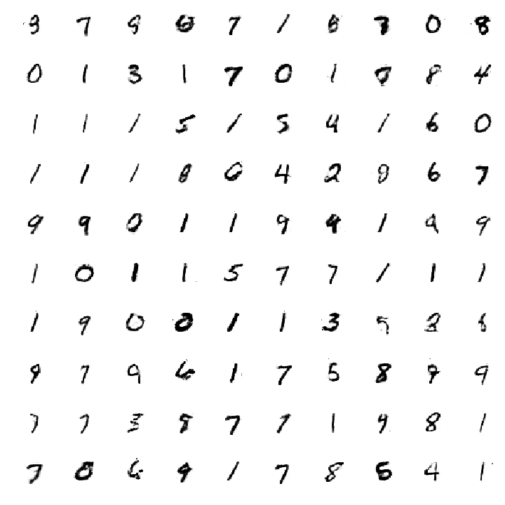

# GAN - Teil 2 - Keras kann auch Ziffern schreiben

## Worum geht es in diesem Teil
Nachdem ich im ersten Teil den grundlegenden Trick der GAN beschrieben habe, möchte ich hier ein einfaches GAN bauen, dass in der Lage ist, die handschriftlichen Ziffern aus der MNIST Datenbank täuschend echt nachzumachen.
Ich verwende für diesen „Zaubertrank“ nur die elementaren Zutaten aus der Speisekammer der neuronalen Netze um mich auf die GAN Spezifika konzentrieren zu können. Nichts desto Trotz ist das Ergebnis schon recht beeindruckend. Wenn ich hier von Zaubertrank und Speisekammer rede, so geschieht das nicht ganz ohne Grund. In der Literatur wird gerne der Ausdruck "Alchemie der GAN" verwendet, der darauf hinweisen soll, dass man viel Erfahrung und Gespür beim Bau von GAN's benötigt. Das liegt daran, dass wir mit unseren neuronalen Netzen mittels Gradientenverfahren nicht einem festen Minima entgegenschreiten, sondern wir suchen ein Gleichgewicht zwischen G(z) und D(x). Dadurch verschieben sich die Minima in den Netzten nach jedem Iterationsschritt. Die Aufgabe beim Bau von GAN's ist es also seine Netzte so zu bauen, dass das Gleichgewicht leicht zu finden ist. Man braucht ein Netz wie eine tiefe Schüssel, in der eine kleine Kugel automatisch dem tiefsten Punkt und damit seinem Gleichgewicht zustrebt. Das andere Extrem ist ein Netz wie ein Bleistift, den man auf der Spitze ausbalancieren möchte, was bekanntlich schnell mal frustrieren kann. 
Hängen wir uns also unsere Druidenmäntel um und greifen zu unseren goldenen Sicheln 😊


## Die lästigen Vorbereitungen
Wie immer sammle ich alle nötigen Importstatements in einem Block 


```python
#tensorflow
import tensorflow as tf
from tensorflow.python.client import device_lib
from keras.backend.tensorflow_backend import set_session

import keras
from keras.layers import Input
from keras.models import Model, Sequential
from keras.layers.core import Dense, Dropout
from keras.layers.advanced_activations import LeakyReLU
from keras.datasets import mnist
from keras.optimizers import Adam, RMSprop
from keras import initializers

config = tf.ConfigProto()
config.gpu_options.allow_growth = True  # dynamically grow the memory used on the GPU
config.log_device_placement = True  # to log device placement (on which device the operation ran)
                                    # (nothing gets printed in Jupyter, only if you run it standalone)
sess = tf.Session(config=config)
set_session(sess)  # set this TensorFlow session as the default session for Keras
print("TensorFlow Version:\t{}".format(tf.__version__))
print("Keras Version:\t\t{}".format(keras.__version__))
print("Found GPU & CPU devices:\n{}".format(device_lib.list_local_devices()))


import numpy as np
import matplotlib.pyplot as plt

# ein hübsches Tool für Progerss Bars
from tqdm import tqdm

# Für das Rauschen brauchen wir Zufallszahlen
np.random.seed(911972)

```

## Daten vorbereiten

* Zuerst besorge ich mir die Testdaten auf dem üblichen Weg. 
* Da ich hier wirklich die einfachsten Netze verwenden möchte (also simple Dense Netze), sammle ich alle Pixelinformationen nicht in einer zwei dimensionalen 28 x 28 Matrix, sondern in einem 28 x 28 = 784 Elemente großen Vektor.
* Ein erster Erfahrungswert ist es, den Tangens Hyperbolicus als finale Aktivierungsfunktion zu verwenden. Deshalb normiere ich meine Daten auf das Intervall von [-1, 1].
* Die Größe des Input Vektors für den Generator setzte ich Zufällig auf 64
* Die Optimierung der Hyperparameter ist die wesentliche Fleißarbeit. Somit sammle ich sie hier in einem Block zusammen.


```python
(real_images_all, __), (__, __) = mnist.load_data()
print('1. Rohdaten:')
print(real_images_all[0, 14, 10:20])

real_images_all = real_images_all.reshape(60000, 784)
print('2. Zum Vektor aufgebogen:')
print(real_images_all[0, 14*28 +10 : 14*28 + 20])

real_images_all = real_images_all.astype('float32')  / 255 * 2 - 1
print('3. in das Interval [-1, 1] normiert:')
print(real_images_all[0, 14*28 +10 : 14*28 + 20])

z_size = 64

# Da ich für alle Netzte einen Optimizer brauche, der ein wenig sanfter als der Default eingestellt ist, monfiguriere ich ihn einmal
#optimizer= Adam(lr=0.0002, beta_1=0.5)
optimizer= RMSprop(lr=0.0008, clipvalue=1.0, decay=1e-8)

# dropout ist wichtig bei GAN
dropout_rate = 0.2

# die steigung der LeakyReLu im negativen Bereich
leaky_faktor = 0.2
```

## Der Generator
Im Prinzip ist der Generator das einfachste Netz, das man bauen kann. Eine kleine Besonderheit hat es aber dennoch. Ich verwende hier ‚LeakyReLU‘ als Ansatzfunktion. Seit einiger Zeit setzt sich ReLU als Allzweckwaffe unter den Ansatzfunktionen der Hidden - Layer durch. Allerdings hat sie eine kleine Schwäche. Dadurch, dass sie den negativen Wertebereich auf Null abbildet, lässt sie Knoten schnell absterben. Ein einmal abgestorbener Knoten wird nicht mehr aktiviert, da auf ihn kein Fehler mehr aufgeteilt wird. Das wirkt sich negativ auf das „tiefe“ propagieren von Fehlern aus. Mit der LeakyReLu wird dieses Problem repariert, indem man den negativen Wertebereich nicht ganz auf 0 abbildet. 

Als Aktivierungsfunktion des letzten Layers wähle ich wie bereits erwähnt den tanh als „magische“ Zutat.


```python
generator = Sequential()
generator.add(Dense(256, input_dim=z_size))
generator.add(LeakyReLU(leaky_faktor))

generator.add(Dense(512))
generator.add(LeakyReLU(leaky_faktor))

generator.add(Dense(1024))
generator.add(LeakyReLU(leaky_faktor))

generator.add(Dense(784, activation='tanh'))
generator.compile(loss='binary_crossentropy', optimizer=optimizer)
generator.summary()

```

## Der Diskriminator
Der Diskriminator ist ähnlich schlicht aufgebaut, wie der Generator. Die Input Dimension ist 28 x 28, also jeweils ein Bild. Die Output Dimension ist ein Skalar zwischen Null und Eins.
Der Diskriminator verfügt anders als der Generator über Dropout Layer, um auch hier den Zufall mit einzubinden. Der Zufall verhindert im GAN, dass sich die Netze zu schnell einschnüren und in einen dünn besiedelten Zustand gleiten. Das ist bei GAN’s sehr schlecht, da die „Kreativität“ in der Vielfalt der Möglichkeiten liegt. Somit müssen möglichst viele Gewichte aktiviert sein um eine möglichst breite Varianz zu bekommen. Der Diskriminator bekommt seine Vielfalt übrigens nicht durch Dropout Layer, sondern durch das Rauschen des Input Vektors z.


```python
discriminator = Sequential()
discriminator.add(Dense(1024, input_dim=784))
discriminator.add(LeakyReLU(leaky_faktor))
discriminator.add(Dropout(dropout_rate))

discriminator.add(Dense(512))
discriminator.add(LeakyReLU(leaky_faktor))
discriminator.add(Dropout(dropout_rate))

discriminator.add(Dense(256))
discriminator.add(LeakyReLU(leaky_faktor))
discriminator.add(Dropout(dropout_rate))

discriminator.add(Dense(1, activation='sigmoid'))
discriminator.compile(loss='binary_crossentropy', optimizer=optimizer)
discriminator.summary()
```

## Das GAN
Um den Generator trainieren zu können, muss man das GAN zusammensetzen.  Dazu nutzt man bei Keras das funktionale API. Damit kann man einem Modell weitere Layer hinzufügen. So wird hier der Input Layer auf den Generator und dieser auf den Diskriminator geschichtet. Danach ruft man den Modell Konstruktor auf, um das GAN zu bekommen.
Übrigens spiegelt sich in der funktionalen Schreibweise von Python die theoretische Herleitung der GAN’s wieder D(G(z)).


```python
# der Diskriminator wird hier gleich eingefroren
discriminator.trainable = False

# der verrauschte Input Vektor
z = Input(shape=(z_size,))

# Das GAN D(G(z))
gan_core = discriminator(generator(z))

# Um ein eigenständiges Netz zu erhalten, baut man sich ein neues Modell
gan = Model(inputs = z, outputs = gan_core)
gan.compile(loss = 'binary_crossentropy', optimizer = optimizer)
gan.summary()

```

## Das Training
Wie im Teil eins beschrieben werden hier folgende Schritte immer wieder abgearbeitet:
1. Zuerst generiert man mit dem Generator einen Stapel Fake – Bilder, wobei wir ein nach Gauß normalverteiltes Rauschen erzeugen. (Es verändert übrigens die Qualität der Ergebnisse, wenn man die Werte σ und µ feinabstimmt.)
2. Diese Bilder nimmt man zusammen mit gleich vielen echten Bildern, um den Diskriminator zu trainieren. Dadurch wird der Diskriminator ein wenig besser.
3. Das GAN trainiert man mit einem Stapel Rauschens und fordert, dass das Ergebnis immer _real_ sein sollen, da wir ja die Realität fälschen wollen. D(G(z)) = 1.


```python
epochs = 5000
batch_size = 128
batch_count = real_images_all.shape[0] / batch_size

σ = 1
µ = 0

history_g = []
history_d = []

for e in range(1, epochs+1):
    print('-'*15, 'Epoch %d' % e, '-'*15)
    for count in tqdm(range(int(batch_count))):
        # 1.1 wir bauen 'bach_size' viele z vektoren mit normalverteiltem Rauschen der Länge 'z_size'
        z = np.random.normal(µ, σ, size=[batch_size, z_size])
        # 1.2 daraus generieren wir Fake Bilder
        fake_images = generator.predict(z)

        # 2.1 dazu entnehmen wir eine gleich große Anzahl an echten Bildern
        real_images = real_images_all[np.random.randint(0, real_images_all.shape[0], size=batch_size)]
        # 2.2 beide Stapel zusammen ergeben die Trainingsmenge für den Diskriminator
        x_dis = np.concatenate([real_images, fake_images])
        # 2.3 der Ergebnisvektor wird mit null also fake vorbelegt
        y_dis = np.zeros(2*batch_size)
        # 2.4 die richtigen Ergebnisse werden nicht mit 1 sondern mit 0.9 belegt. 
        #     Das nennt sich "one-sided label smoothing" und dient dazu die "Früchte" 
        #     nicht allzu hoch zu hängen 
        y_dis[batch_size:] = 0.9
        # 2.5 den Diskriminator auffrieren
        discriminator.trainable = True
        # 2.6 und trainieren
        history_d.append(discriminator.train_on_batch(x_dis, y_dis))

        # 3.1 Wieder eine Stapel Rauschen bauen
        x_gan = np.random.normal(µ, σ, size=[batch_size, z_size])
        # 3.2 Um echte Bilder vorzutäuschen belegen wir die Antwort mit Null
        y_gan = np.zeros(batch_size)
        # 3.3 Den diskriminator einfrieren, um seine Gewichte nicht zu ändern
        discriminator.trainable = False
        # 3.4 und so den generator mittelbar als Teil des GANs trainieren
        history_g.append(gan.train_on_batch(x_gan, y_gan))
        
    # alle 20 Schritte werfe ich eine kleine Auswertung aus    
    if e == 1 or e % 20 == 0:
        # 1. Die entwicklung der Verlusraten beider Trainings
        plt.plot(history_g, 'r', label='generator loss')
        plt.plot(history_d, 'b', label='discriminator loss')
        plt.title('Training of D(x) and D((g(z)))')
        plt.legend()
        plt.show()
        plt.close()

        examples = 100
        dim=(10, 10)
        figsize=(10, 10)
        noise = np.random.normal(µ, σ, size=[examples, z_size])
        generated_images = generator.predict(noise)
        generated_images = generated_images.reshape(examples, 28, 28)

        # 2. Ein paar Demobilder
        plt.figure(figsize=figsize)
        for i in range(generated_images.shape[0]):
            plt.subplot(dim[0], dim[1], i+1)
            plt.imshow(generated_images[i], interpolation='nearest', cmap='gray_r')
            plt.axis('off')
        plt.tight_layout()
        plt.savefig('output/gan_generated_image_epoch_%d.png' % e)
        plt.close()
        
    # alle 40 Schritte speicher ich das Modell des generators
    if e % 40 == 0:
        # Gewichte speichern
        generator.save('output_model/generator_model_%d.h5' % e)
        # Konfiguration speichern
        model_json = generator.to_json()
        with open("output_model/generator_model_{}.json".format(e), "w") as json_file:
            json_file.write(model_json)

```

## Schluss und wie geht es von hier weiter

### Ergebnisse
Nach der ersten Epoche sehen die Ziffern noch so aus:


Wenn man dem Netz nun  ein wenig Zeit gibt, wird man schon nach wenigen Iterationen feststellen, dass Die Ergebnisse durchaus beeindruckend sind. 

Nach 300 Epochen sieht das Ergebnis dann so aus


Lässt man das Netz weiter trainieren, stellt man fest, dass sich das Ergebnis nicht mehr wesentlich verbessert. Hier das Ergebnis nach 700 Epochen:




Anscheinend ist das Netz an seiner Leistungsgrenze und konvergiert wirklich in ein stabiles Gleichgewicht. Natürlich fällt auf, dass viele der Ziffern sehr geschmiert erscheinen. Dazu darf man aber nicht vergessen, dass auch die originalen Ziffern, die der Diskriminator zum Trainieren bekommen hat nicht gerade einen Schönschreibwettbewerb gewinnen würden:


Im Endeffekt erfindet das Netz nicht wirklich neue Ziffern, sondern bildet ein statistisches Mittel aus allen Bildern, mit denen es trainiert wurde und hebt Variationen aus dem Latenzraum, also den Raum der möglichen richtigen Ziffern. 
Was man nun als folgenden Schritt noch machen sollte, sind zwei Prüfungen:

### Verteilung der Ziffern
Sind die erfundenen Ziffern gleich verteilt? Wenn ich also zum Beispiel 100.000 Ziffern erfinden lasse, so sollten etwa 10.000 Stück pro einzelne Ziffer vorhanden sein. 

### Trennschärfe der Ziffern
Wie deutlich lassen sich die erfundenen Ziffern erkennen? In einem meiner letzten Blogs ([So entwirft man ein Top CNN](https://www.mt-ag.com/so-entwirft-man-ein-top-cnn/)) habe ich ein recht passables Netz implementiert, das Ziffern mit hoher Genauigkeit erkennt. Wenn die erfundenen Ziffern nun durch dieses Netz geschickt werden, kann man prüfen, wie genau eine Ziffer zwischen Null und Neun erkannt wird. Ein mögliches Maß für diese Genauigkeit ist die von mir definierte Trennschärfe [Trennschärfe bei der Klassifizierung](https://www.mt-ag.com/trennschaerfe-bei-der-klassifizierung/)

### Und weiter
Die Architektur um die GAN’s hat sich schnell und tief entwickelt. Allerdings liegt der Fokus stark auf Bildern. Ich denke, man sollte auch Texten, Musik und Daten einer genaueren Untersuchung unterziehen, um auch hier Artefakte täuschend echt nachzuahmen. Alles in allem geht mit den GAN’s für mich die Reise in Richtung Turing Test…

Ich wünsche Dir viel Spaß beim Ausprobieren.


